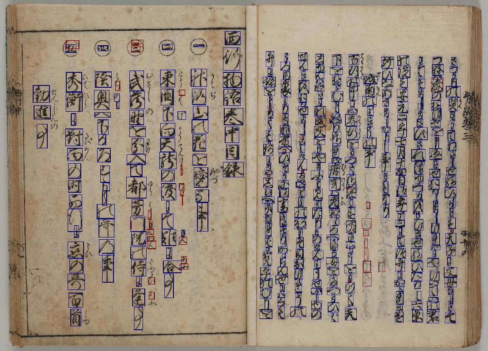

# 3rd place solution overview: 2-stage + FalsePositive Predictor

Thanks to all for organizers this very interesting competition.
Congratulations to all who finished the competition and to the winners.

Below is an overview of my solution.

Code: [https://github.com/knjcode/kaggle-kuzushiji-recognition-2019](https://github.com/knjcode/kaggle-kuzushiji-recognition-2019)  
Trained weights: [https://github.com/knjcode/kaggle-kuzushiji-recognition-2019/releases](https://github.com/knjcode/kaggle-kuzushiji-recognition-2019/releases)

2-stage approach + FalsePositive Predictor.

- Detection with Faster R-CNN ResNet101 backbone
- Classification with 5 models with L2-constrained Softmax loss (EfficientNet, SE-ResNeXt101, ResNet152)
- Postprocessing (LightGBM FalsePositive Predictor)


## Preprocess

Denoising and Ben's preprocessing for train and test images.

Thanks for the following notebook  
[Denoising + Ben's Preprocessing = Better Clarity](https://www.kaggle.com/hanmingliu/denoising-ben-s-preprocessing-better-clarity)


## Detection

Detection model use Faster R-CNN with:
- ResNet101 backbone
- Multi-scale train&test
- data augmentation (brightness, contrast, saturation, hue, random grayscale)
- no vertical and horizontal flip

use customized [maskrcnn_benchmark](maskrcnn_benchmark/)

Training Detection model with all train images. And validation with public Leaderboard score.

See config for details. [e2e_faster_rcnn_R_101_C4_1x_2_gpu_voc.yaml](https://github.com/knjcode/kaggle-kuzushiji-recognition-2019/blob/master/configs/kuzushiji/e2e_faster_rcnn_R_101_C4_1x_2_gpu_voc.yaml)


### Book title classifier

To know the trend of test data image distribution,
I have trained a model to estimate the title of a book using train data.

See training script for details [train_book_title_classifier.sh](train_scripts/train_book_title_classifier.sh)

The accuracy of trained model is about 99%.

Then I estimated the book title for each image in the test data.

The following is the estimation result of the book title of each image of the test data.
```
  count  book title
      4  100241706
      0  100249371
     46  100249376
     60  100249416
      0  100249476
      9  100249537
    209  200003076
    550  200003967
      1  200004148
      0  200005598
    497  200006663
    178  200014685
    818  200014740
     95  200015779
      0  200021637
      9  200021644
     18  200021660
      2  200021712
    177  200021763
      0  200021802
     21  200021851
      0  200021853
    157  200021869
      0  200021925
     88  200022050
   1210       brsk
      9       hnsd
      1       umgy
```

Based on this result, I used the top 5 book tile above (brsk, 200014740, 200003967, 200006663, 200003076) for local validation.

At the same time, I confirmed that there was almost no bias in public and private test data by submitting the recognition results with the specific book title omitted.


## Classification

ensemble 5 classification models (hard voting)

### validation strategy

Dataset is split train and validation by book titles.

generate 2 patterns of training datasets.
- validation: book_title=200015779 train: others
- validation: book_title=200003076 train: others

Characters with few occurrences oversampling at this time.

For details, see [gen_csv_denoised_pad_train_val.py](https://github.com/knjcode/kaggle-kuzushiji-recognition-2019/blob/master/scripts/gen_csv_denoised_pad_train_val.py)


### preprocessing and data augmentation

- Preprocessing
  - Denoising and Ben's preprocessing for train and test images, then crop characters
  - When cropping each character, enlarge the area by 5% vertically and horizontally
  - Resize each character to square ignoring aspect ratio
  - To reduce computational resource, some models training with grayscale image
  - To reduce computational resource, undersampling characters that appeared more than 2000 times have been undersampled to 2000 times
- Data augmentation
  - brightness, contrast, saturation, hue, random grayscale, rotate, random resize crop
  - mixup + RandomErasing or ICAP + RandomErasing (details of ICAP will be described later)
  - no vertical and horizontal flip
- Others
  - Use L2-constrained Softmax loss for all models
    - I also tried AdaCos, ArcFace, CosFace, but L2-constrained Softmax was better.
  - Warmup learning rate (5epochs)
  - SGD + momentum Optimizer
  - MultiStep LR or Cosine Annealing LR
  - Test-Time-Augmentation 7 crop

For more details, see options of [model training scripts](https://github.com/knjcode/kaggle-kuzushiji-recognition-2019/blob/master/train_scripts/01_efficientnet_b4_val15779_l2softmax_mixup_re_normalize_gray190.sh)


#### models
|model arch     |channel  |input size|data augmentation    |validation|
|:--------------|:--------|:---------|:--------------------|:---------|
|EfficientNet-B4|Grayscale|190x190   |mixup + RandomErasing|200015779 |
|ResNet152      |Grayscale|112x112   |mixup + RandomErasing|200015779 |
|SE-ResNeXt101  |RGB      |112x112   |mixup + RandomErasing|200015779 |
|SE-ResNeXt101  |RGB      |112x112   |ICAP + RandomErasing |200003076 |
|ResNet152      |RGB      |112x112   |ICAP + RandomErasing |200003076 |


#### example of mixup + RandomErasing


#### example of ICAP + RandomErasing

ICAP is the data augmentation method I have implemented.
Images cut from the four images are pasted while keeping the original image position.


## Pseudo labeling

Use the predicted result using the model trained in the previous steps as the pseudo label.

### Retrian classification model

- train with pseudo label
- train final 3 epoch without data augmentation

|model arch     |local val acc|Private Leadearbord|
|:--------------|:------------|:------------------|
|EfficientNet-B4|0.9666       |0.941              |
|ResNet152      |0.9635       |-                  |
|SE-ResNeXt101  |0.9610       |0.934              |
|SE-ResNeXt101  |0.9629       |-                  |
|ResNet152      |0.9644       |-                  |


### NMS with 2 ensemble results

NMS 2 snapshot result of Faster R-CNN object detetor (iter=60000, 100000)


## Postprocessing (FalsePositive Predictor)

Train a classifier that predicts false positive results from validation results.

Use classification and detection score(probability) and geometric relationship between bounding boxes as a feature.

For details, see [scripts/optuna_search_for_false_positive_detector.py](scripts/optuna_search_for_false_positive_detector.py) and [scripts/gen_false_positive_detector.py](scripts/gen_false_positive_detector.py)

Using this predictor increased the score by about 0.002 ~ 0.004

The following is a sample of false positive prediction result (The box predicted to be false positive is drawn with a red line).



## Ideas not yet tried

- Using SoftTriple loss ([SoftTriple Loss: Deep Metric Learning Without Triplet Sampling](https://arxiv.org/abs/1909.05235))
  - SoftTriple loss to extend the SoftMax loss with multiple centers for each class.
  - I think SoftTriple loss is especially effective in classifying the 変体仮名 (hentaigana).
- Use the aspect ratio of characters for classification
  - When recognizing characters, they are resized to a fixed size without considering the aspect ratio of each character. Aspect ratio also seems to be effective for character recognition, so it should be used as an input feature of the classification model.


## Hardware and libraries

GCP (V100x2) 128or256GB Memory 32Core


