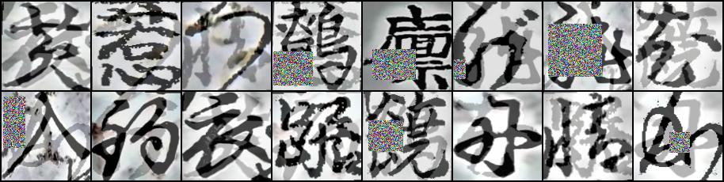
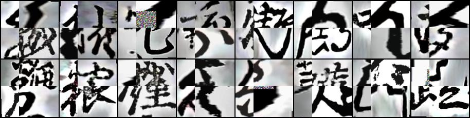

# Reproduce Character classification model

## Overview

### validation strategy

Dataset is split train and validation by book titles.

generate 2 patterns of training datasets.
- validation: book_title=200015779 train: others
- validation: book_title=200003076 train: others

Characters with few occurrences oversampling at this time.

For details, see [gen_csv_denoised_pad_train_val.py](https://github.com/knjcode/kaggle-kuzushiji-recognition-2019/blob/master/scripts/gen_csv_denoised_pad_train_val.py)


### preprocessing and data augmentation

- Preprocessing
  - Denoising and Ben's preprocessing for train and test images, then crop characters
  - When cropping each character, enlarge the area by 5% vertically and horizontally
  - Resize each character to square ignoring aspect ratio
  - To reduce computational resource, some models training with grayscale image
  - To reduce computational resource, undersampling characters that appeared more than 2000 times have been undersampled to 2000 times
- Data augmentation
  - brightness, contrast, saturation, hue, random grayscale, rotate, random resize crop
  - mixup + RandomErasing or ICAP + RandomErasing (details of ICAP will be described later)
  - no vertical and horizontal flip
- Others
  - Use L2-constrained Softmax loss for all models
  - Warmup learning rate (5epochs)
  - SGD + momentum Optimizer
  - MultiStep LR or Cosine Annealing LR
  - Test-Time-Augmentation 7 crop

For more details, see options of [model training scripts](https://github.com/knjcode/kaggle-kuzushiji-recognition-2019/blob/master/train_scripts/01_efficientnet_b4_val15779_l2softmax_mixup_re_normalize_gray190.sh)


#### models
|model arch     |channel  |input size|data augmentation    |validation|
|:--------------|:--------|:---------|:--------------------|:---------|
|EfficientNet-B4|Grayscale|190x190   |mixup + RandomErasing|200015779 |
|ResNet152      |Grayscale|112x112   |mixup + RandomErasing|200015779 |
|SE-ResNeXt101  |RGB      |112x112   |mixup + RandomErasing|200015779 |
|SE-ResNeXt101  |RGB      |112x112   |ICAP + RandomErasing |200003076 |
|ResNet152      |RGB      |112x112   |ICAP + RandomErasing |200003076 |


#### example of mixup + RandomErasing



#### example of ICAP + RandomErasing

ICAP is the data augmentation method I have implemented.
Images cut from the four images are pasted while keeping the original image position.




### training flow

- First training
  - Training 5 models with only training dataset (80~90epoch)
- Pseudo labelling
  - Generate pseudo label and pseudo cropped images using 5 models with the best validation accuracy from the first training.
- Second training
  - Training 5 models again with train and pseudo images (80~90epoch)
- Refinement
  - Choose models with the best validation accuracy from the second training and resume training.
  - Using smoother target (0.9) for pseudo images, but 1.0 for original train images.
  - Traininng each model 3 epochs including pseudo images without data augmentaion.

You can download the refinemented models from here.

- [01_refine_efficientnet_b4_l2softmax_gray190-0060.model](https://github.com/knjcode/kaggle-kuzushiji-recognition-2019/releases/download/0.0.1/01_refine_efficientnet_b4_l2softmax_gray190-0060.model)
- [02_refine_resnet152_l2softmax_gray112-0069.model](https://github.com/knjcode/kaggle-kuzushiji-recognition-2019/releases/download/0.0.1/02_refine_resnet152_l2softmax_gray112-0069.model)
- [03_refine_seresnext101_l2softmax_rgb112-0080.model](https://github.com/knjcode/kaggle-kuzushiji-recognition-2019/releases/download/0.0.1/03_refine_seresnext101_l2softmax_rgb112-0080.model)
- [04_refine_seresnext101_l2softmax_rgb112-0082.model](https://github.com/knjcode/kaggle-kuzushiji-recognition-2019/releases/download/0.0.1/04_refine_seresnext101_l2softmax_rgb112-0082.model)
- [05_refine_resnet152_l2softmax_rgb112-0090.model](https://github.com/knjcode/kaggle-kuzushiji-recognition-2019/releases/download/0.0.1/05_refine_resnet152_l2softmax_rgb112-0090.model)


## Details of training Flow

Training model inside the docker container. Start the docker container with `run.sh`.
And train using shellscripts under `train_scripts` directory.

## First training

```
# bash train_scripts/01_efficientnet_b4_val15779_l2softmax_mixup_re_normalize_gray190.sh
... wait many hours
# bash train_scripts/02_resnet152_val15779_l2softmax_mixup_re_gray112.sh
... wait many hours
# bash train_scripts/03_seresnext101_val15779_l2softmax_mixup_re_rgb112.sh
... wait many hours
# bash train_scripts/04_seresnext101_val3076_l2softmax_icap_re_rgb112.sh
... wait many hours
# bash train_scripts/05_resnet152_val3076_l2softmax_icap_re_rgb112.sh
... wait many hours
```

The five models require the following training time.

- 01 about 44hours at GCP(V100x2)
- 02 about 29hours at GCP(V100x2)
- 03 about 32hours at GCP(V100x2)
- 04 about 30hours at GCP(V100x2)
- 05 about 27hours at GCP(V100x2)


## Pseudo labelling

Generate pseudo labels (pseudo images) with 5 models from the first training.

### Ensemble and NMS with First training models

When generating pseudo labels, model ensemble uses soft voting insted of hard voting.
Then NMS 2 generated results.


#### Generate results with single detector and 5 models

```
$ bash scripts/auto_generate_first_model_results.sh
```

generates 4 results

`val_detector_060000_tta7_first_5models_soft_prob`
`val_detector_100000_tta7_first_5models_soft_prob`
`test_detector_060000_tta7_first_5models_soft_prob`
`test_detector_100000_tta7_first_5models_soft_prob`

#### NMS with 2 ensemble results (validation and test)

```
$ scripts/results_nms_first_model_val.py
$ scripts/results_nms_first_model_test.py
```

generates 2 results

`val_nms030_tta7_first_5models_soft_prob`
`test_nms030_tta7_first_5models_soft_prob`

#### Postprocessing (FalsePositive predictor)

Generate FalsePositive predictor using validation results.

searching hyper parameter with optuna
```
$ scripts/optuna_search_for_first_model_false_positive_detector.py
....
{'lambda_l1': 1.5464112458912599e-06, 'lambda_l2': 5.346737781503549e-06, 'num_leaves': 140, 'feature_fraction': 0.8534057661739842, 'bagging_fraction': 0.9376615592819334, 'bagging_freq': 1, 'min_child_samples': 72}
```

generate FalsePositive predictor for first models
```
$ scripts/gen_first_model_false_positive_detector.py
...
saved: models/booster_for_val_nms030_tta7_first_5models_soft_prob.pkl
```

#### Generate pseudo images

```
$ python scripts/gen_pseudo_label.py
```

saved pseudo images under `input/pseudo_images`

In addition, the submission file at this point is generated as first_submission.csv

The scores at this time were:
- Private Score: `0.930`
- Public Score: `0.928`


## Second training

### Add pseudo images to training data

If you execute the following command after generating pseudo images,
csv files for training data with pseudo images added will be generated.

```
$ bash scripts/gen_pseudo_csvs.sh
```

generates 2 csv files

`input/denoised_train_pseudo_200015779.csv`
`input/denoised_train_pseudo_200003076.csv`


### Training 5 models with pseudo images

Training 5 models again with train and pseudo images (80~90epoch)

```
$ bash train_scripts/pseudo_labeling/01_efficientnet_b4_val15779_coslinear_mixup_re_normalize_gray190.sh
... wait many hours
$ bash train_scripts/pseudo_labeling/02_resnet152_val15779_coslinear_mixup_re_gray112.sh
... wait many hours
$ bash train_scripts/pseudo_labeling/03_seresnext101_val15779_coslinear_mixup_re_rgb112.sh
... wait many hours
$ bash train_scripts/pseudo_labeling/04_seresnext101_val3076_coslinear_icap_re_rgb112.sh
... wait many hours
$ bash train_scripts/pseudo_labeling/05_resnet152_val3076_coslinear_icap_re_rgb112.sh
... wait many hours
```

The five models require the following training time.

- 01 about 44hours at GCP(V100x2)
- 02 about 29hours at GCP(V100x2)
- 03 about 32hours at GCP(V100x2)
- 04 about 30hours at GCP(V100x2)
- 05 about 27hours at GCP(V100x2)


## Refinement

- Choose models with the best validation accuracy from the second training and resume training.
- Using smoother target (0.9) for pseudo images, but 1.0 for original train images.
- Traininng each model 3 epochs including pseudo images without data augmentaion.


```
$ bash train_scripts/pseudo_refine/01_refine_efficientnet_b4_l2softmax_gray190.sh
... wait a few hours
$ bash train_scripts/pseudo_refine/02_refine_resnet152_l2softmax_gray112.sh
... wait a few hours
$ bash train_scripts/pseudo_refine/03_refine_seresnext101_l2softmax_rgb112.sh
... wait a few hours
$ bash train_scripts/pseudo_refine/04_refine_seresnext101_l2softmax_rgb112.sh
... wait a few hours
$ bash train_scripts/pseudo_refine/05_refine_resnet152_l2softmax_rgb112.sh
... wait a few hours
```

The five models require 2 or 3 hours training time.


You can download the refinemented models from here. (repeat)

- [01_refine_efficientnet_b4_l2softmax_gray190-0060.model](https://github.com/knjcode/kaggle-kuzushiji-recognition-2019/releases/download/0.0.1/01_refine_efficientnet_b4_l2softmax_gray190-0060.model)
- [02_refine_resnet152_l2softmax_gray112-0069.model](https://github.com/knjcode/kaggle-kuzushiji-recognition-2019/releases/download/0.0.1/02_refine_resnet152_l2softmax_gray112-0069.model)
- [03_refine_seresnext101_l2softmax_rgb112-0080.model](https://github.com/knjcode/kaggle-kuzushiji-recognition-2019/releases/download/0.0.1/03_refine_seresnext101_l2softmax_rgb112-0080.model)
- [04_refine_seresnext101_l2softmax_rgb112-0082.model](https://github.com/knjcode/kaggle-kuzushiji-recognition-2019/releases/download/0.0.1/04_refine_seresnext101_l2softmax_rgb112-0082.model)
- [05_refine_resnet152_l2softmax_rgb112-0090.model](https://github.com/knjcode/kaggle-kuzushiji-recognition-2019/releases/download/0.0.1/05_refine_resnet152_l2softmax_rgb112-0090.model)


## References

- [mixup: Beyond Empirical Risk Minimization](https://arxiv.org/abs/1710.09412)
- [Random Erasing Data Augmentation](https://arxiv.org/abs/1708.04896)
- [Data Augmentation using Random Image Cropping and Patching for Deep CNNs](https://arxiv.org/abs/1811.09030)
- [CutMix: Regularization Strategy to Train Strong Classifiers with Localizable Features](https://arxiv.org/abs/1905.04899)
- [Data Augmentation Revisited: Rethinking the Distribution Gap between Clean and Augmented Data](https://arxiv.org/abs/1909.09148)

